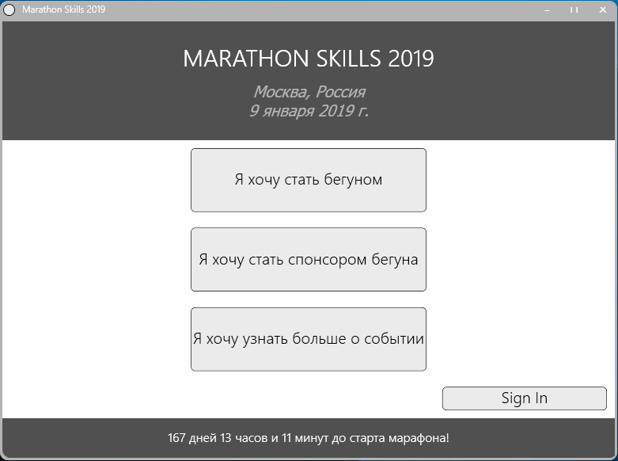
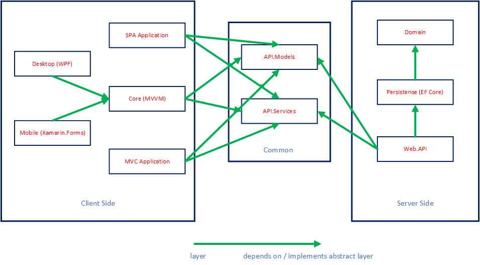

# Marathon
##### Marathon - это учебный проект, в котором я разрабатываю fullstack информационную систему.

Внимание! Этот проект находится на стадии разработки
------



### Разрабатывая приложение добился основных критериев, которые присущи production проектам:

* Масштабируемость - решение должно быть разбито на отдельные проекты. Таким образом порождается слабая связанность между, например, представлением и сущностями доменного уровня;
* Тестируемость - вследствие предыдущего пункта - каждый отдельный уровень бизнес-логики должен иметь возможность создания test-case в изолированном окружении. Это достигается созданием заглушек внешних зависимостей;
* Безопасность - веб-служба, помимо общепринятого протокола HTTPS, должен иметь аутентификацию для защиты от несанкционированного доступа со стороны клиента;
* Независимость от источника данных - достигается за счет внедрения зависимостей (Dependency Injection) в связке с ORM фреймворками, которые, в свою очередь, используют шаблоны Unit-Of-Work и Repository для каждой сущности.

------

### Используемый стек технологий:

По ссылкам содержится детальное пояснение каждого проекта.

* Backend:
  * [ASP.NET Core WEB.API](Src/Marathon.API/README.md);
  * [ORM Entity Framework Core](Src/Marathon.Persistence/README.md);
  * MSSQL Express (имеется возможность использования другой СУБД за счет ORM);

* Frontend:
  * [Desktop - WPF](Src/Marathon.Desktop/README.md);
  * [Мобильное - Xamarin.Forms](Src/Marathon.Mobile/Marathon.Mobile/README.md);
  * Web:
    * [ASP.NET Core MVС](Src/Marathon.MVC/README.md);
    * [ASP.NET Core SPA с использованием React.JS + Redux](Src/Marathon.SPA/README.md).

------

### Архитектрура приложения:



------

## [Техническое задание](/Docs)

------

## Системные требования

1. Microsoft Visual Studio 2017;
2. ASP.NET Core 2.1 SDK;
3. Node.js (для запуска SPA приложения).


Мобильное приложение:
1. Установленный пакет для разработки кросс-платформенных приложений (Xamarin);
2. Android API 27 уровня.

------

## Порядок работы

1. Создайте клон репозитория на своей локальной машине:
   ```
    https://github.com/NorthRebel/Marathon.git
   ```
2. Откройте решение в Visual Studio;
2. Восстановите зависимости проектов используя package manager console:
    ```
    Update-Package 
   ```
3. Установите запуск нескольких проектов, для этого:
   * Нажмите ПКМ по решению;
   * Выберите пункт "Выбрать запускаемые проекты"
   * В появившемся диалоговом окне выберите "Запуск нескольких":
   * Далее, для проектов описанных ниже, выберите "Запуск":
     * Marathon.API (обязательно);
     * Настольное - Marathon.Desktop;
     * Мобильное - (Marathon.Mobile);
     * MVC - (Marathon.MVC);
     * SPA - (Marathon.SPA);
5. Нажмите F5 для запуска проектов
6. Чтобы открыть SPA приложение в адресной строке введите:
    ```
    http://localhost:53070/ 
   ```
7. Чтобы открыть MVC приложение в адресной строке введите:
    ```
    http://localhost:5002/ 
   ```
8. Чтобы посмотреть REST документацию веб-службы в адресной строке введите:
    ```
    http://localhost:5000/swagger/ 
   ```

------

## Лицензия

Этот проект лицензирован по лицензии MIT - подробности см. в файле [LICENSE.md](/LICENSE.md).